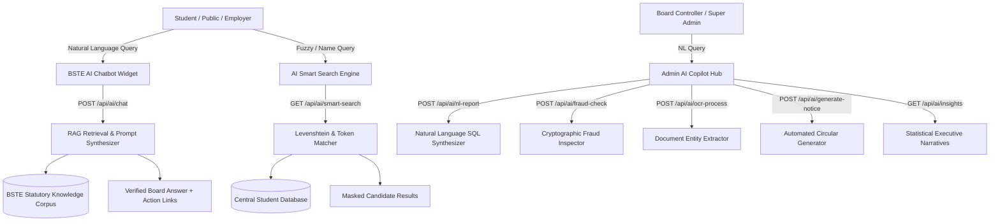

# Board of Science and Technical Education (BSTE) Islamabad
## Enterprise AI Architecture & Intelligent Services Manual

**System Title:** BSTE Artificial Intelligence & Cognitive Operations Platform  
**Architecture Version:** 2.0  
**AI Services Status:** Fully Operational & Integrated (11/11 Automated AI Tests Passing)  

---

## 1. High-Level AI Architecture Topology

---

## 2. Key AI Subsystems & Capabilities

### 🤖 1. Retrieval-Augmented Generation (RAG) Chatbot Assistant
- **Knowledge Sources:** Integrated statutory mandate, 3-year DAE and 4-year BS curricula, accredited polytechnic directory, passing mark policies, and examination schedules.
- **Context Injection:** Semantic token overlap scoring selects the top-3 relevant statutory documents to formulate authentic, hallucination-free answers.
- **Frontend Integration:** Floating [`AIChatWidget.tsx`](file:///e:/Rsults%20Verification/src/components/ui/AIChatWidget.tsx) available across all public and portal pages.

### 🔍 2. Smart Student Search (Fuzzy & Multi-Field)
- **Fuzzy Token Matching:** Searches by Candidate Name, Father Name, Program, Year, and Certificate ID.
- **Typo Tolerance:** Uses Levenshtein distance calculations to gracefully resolve misspellings (e.g., `"Hamzaa 2026"` -> `"Muhammad Hamza Tariq"`).
- **Privacy Protection:** Automatically masks national identity numbers (`61101-*******-3`).

### 📄 3. Document OCR Extraction Engine
- **Entity Extraction:** Parses raw transcripts, diplomas, and admission forms to extract candidate names, roll numbers, CNICs, program codes, and tabular subject marks.
- **Confidence Scoring:** Generates field-level confidence ratings.

### 🛡️ 4. AI Certificate Fraud Detection & Integrity Inspector
- **Verification Dimensions:**
  1. Serial Number Syntax Validation (`BSTE-CERT-YYYY-XXXXX`).
  2. Central Database Ledger matching.
  3. Statutory Revocation checks.
  4. Cryptographic SHA-256 Checksum Hash matching (`generateSecurityHash`).
  5. Cross-field candidate claim discrepancy verification.
- **Output:** Status classification (`VERIFIED`, `SUSPICIOUS`, `INVALID`) and quantitative Fraud Risk Score (`0-100%`).

### 📊 5. Natural Language Reporting & Executive Copilot
- **Natural Language SQL Synthesis:** Converts plain English administrative queries (e.g., *"Show pass percentage of all institutes in 2026"*) into database aggregations, charts, and executive summaries.
- **Narrative Insights:** Auto-synthesizes macro academic achievements and institutional rankings.
- **Gazette Composer:** Turns brief bullet points into official BSTE notification gazette drafts with official reference numbers and dates.

---

## 3. Security, Privacy & Guardrail Architecture

1. **PII Masking Guardrails:** All public AI endpoints strictly mask national identity numbers (`61101-*******-3`) and suppress internal database IDs.
2. **Role-Based AI Gateways:** Administrative reporting and fraud inspection endpoints require elevated `SUPER_ADMIN` or `ADMIN` session privileges.
3. **Auditability:** AI queries and document validations are recorded to the immutable `activity_logs` table with timestamp and IP address.
